# MermaidJS Documentation for LLMs

Mermaid is a JavaScript-based diagramming and charting tool that uses Markdown-inspired text definitions to create diagrams. This document provides comprehensive syntax references for all diagram types.

## General Syntax Rules

- All diagrams begin with a declaration of the diagram type
- Line comments start with `%%`
- Unknown words and misspellings will break a diagram
- Parameters silently fail if incorrect

## Diagram Types

### 1. Flowchart

Flowcharts are composed of nodes (geometric shapes) and edges (arrows or lines).

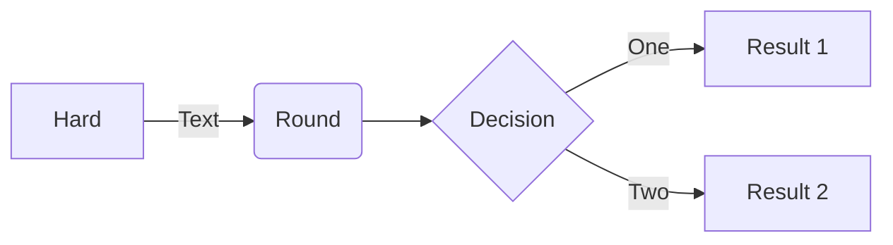

**Direction options:** TB (top to bottom), BT (bottom to top), LR (left to right), RL (right to left)

**Node shapes:**
- `[text]` - Rectangle
- `(text)` - Rounded rectangle
- `{text}` - Diamond (decision)
- `([text])` - Stadium shape
- `[[text]]` - Subroutine
- `[(text)]` - Cylinder (database)
- `((text))` - Circle
- `>text]` - Asymmetric shape

**Arrow types:**
- `-->` - Arrow
- `---` - Line
- `-.->` - Dotted arrow
- `==>` - Thick arrow
- `--text-->` - Arrow with text
- `-->|text|` - Arrow with text (alternative)

**Subgraphs:**
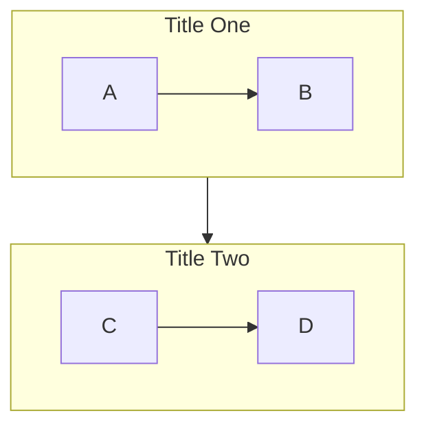

---

### 2. Sequence Diagram

Represents processes and interactions between participants.

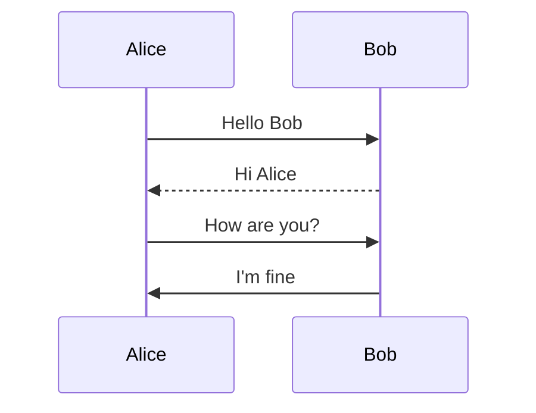

**Arrow types:**
- `->` - Solid line without arrow
- `-->` - Dotted line without arrow
- `->>` - Solid line with arrow
- `-->>` - Dotted line with arrow
- `-x` - Solid line with cross
- `--x` - Dotted line with cross
- `-)` - Solid line with open arrow (async)
- `--)` - Dotted line with open arrow (async)

**Activation:**
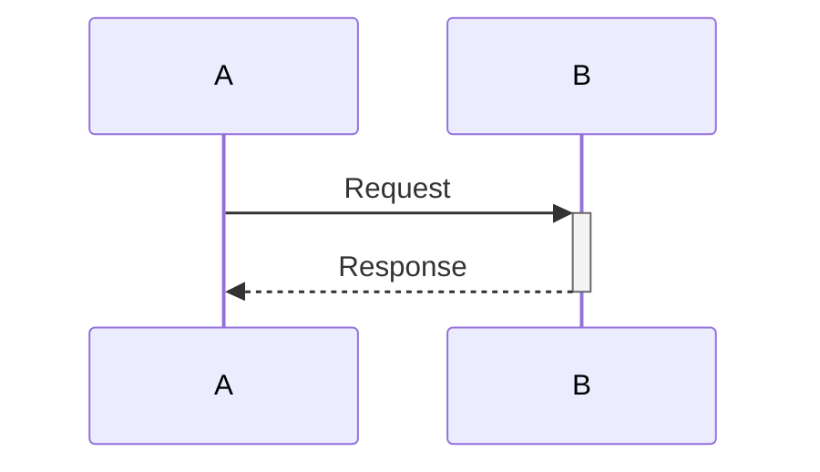

**Notes:**
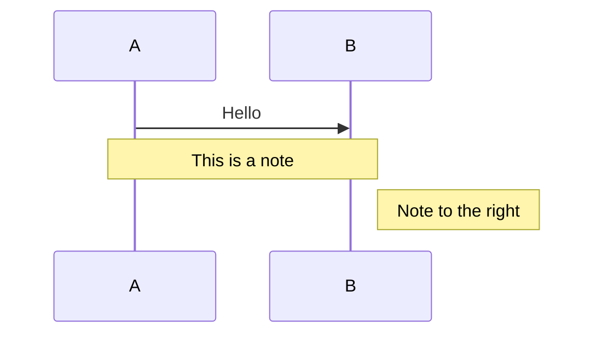

**Loops and conditionals:**
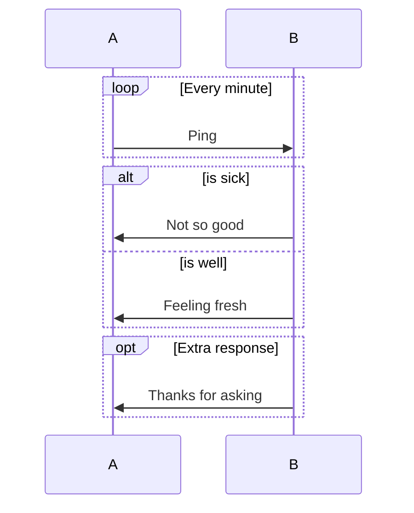

---

### 3. C4 Diagram

C4 diagrams model software architecture at four levels: Context, Container, Component, Code.

**C4Context:**
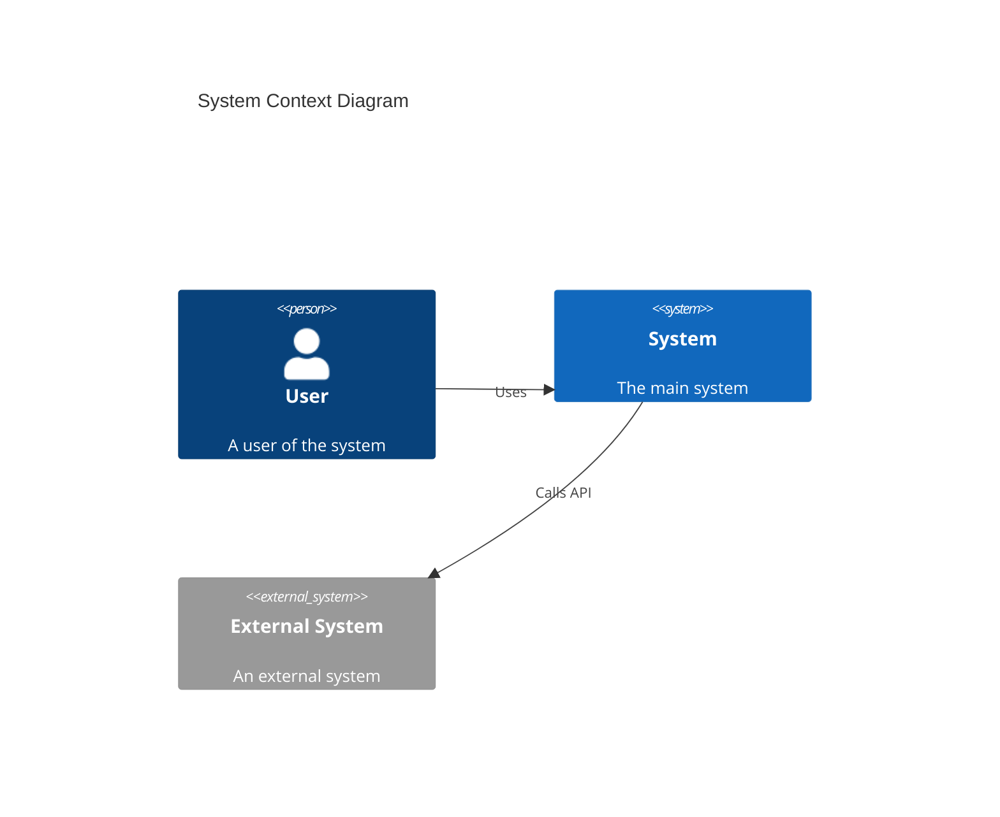

**C4Container:**
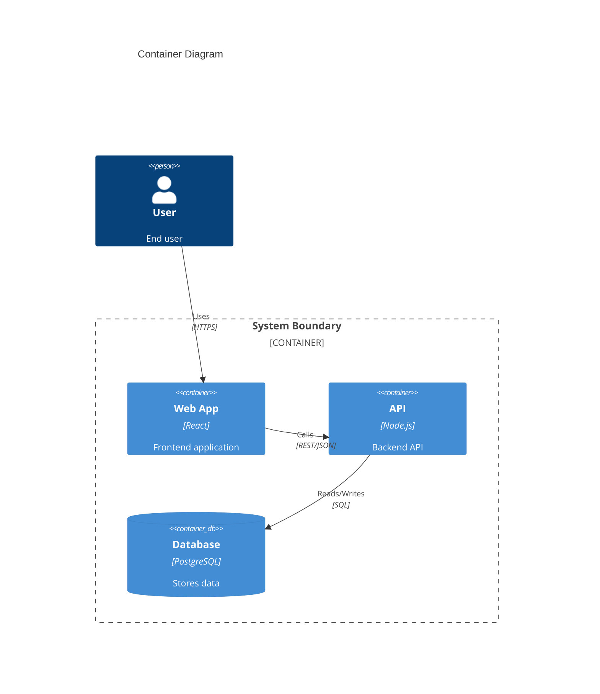

**C4Component:**
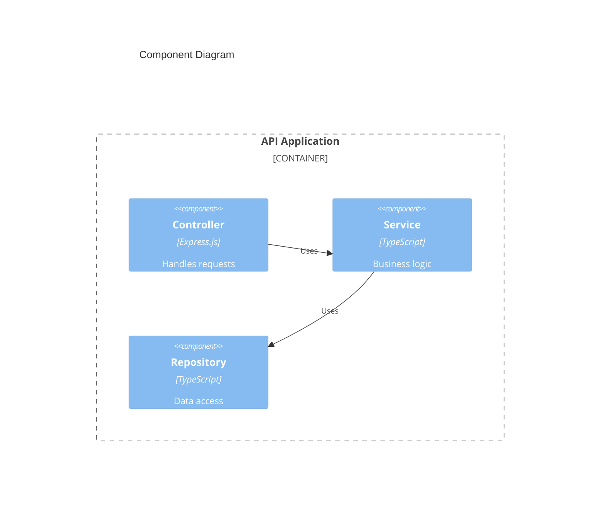

**Elements:**
- `Person(alias, label, description)` - A person/actor
- `System(alias, label, description)` - A software system
- `System_Ext(alias, label, description)` - External system
- `Container(alias, label, technology, description)` - A container
- `ContainerDb(alias, label, technology, description)` - Database container
- `Component(alias, label, technology, description)` - A component
- `Container_Boundary(alias, label)` - Boundary grouping

**Relationships:**
- `Rel(from, to, label)` - Relationship
- `Rel(from, to, label, technology)` - Relationship with technology
- `BiRel(from, to, label)` - Bidirectional relationship

**Styling:**
- `UpdateRelStyle(from, to, $offsetX="0", $offsetY="0")` - Adjust relationship label position

---

### 4. Class Diagram

Models object-oriented class structures.

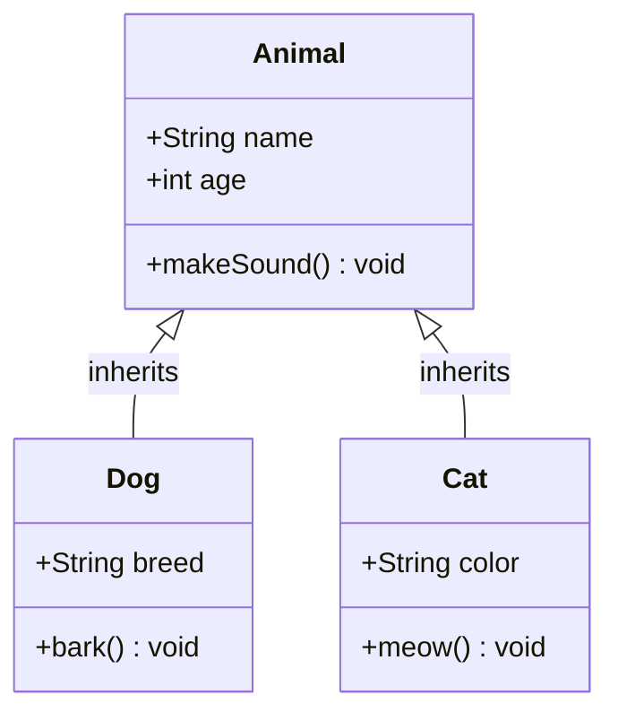

**Visibility:**
- `+` Public
- `-` Private
- `#` Protected
- `~` Package/Internal

**Relationships:**
- `<|--` - Inheritance
- `*--` - Composition
- `o--` - Aggregation
- `-->` - Association
- `--` - Link (solid)
- `..>` - Dependency
- `..|>` - Realization

**Cardinality:**
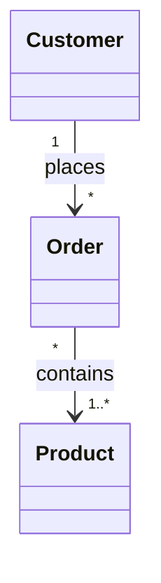

---

### 5. State Diagram

Models state machines and state transitions.

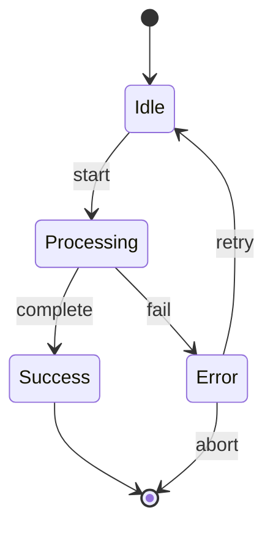

**Composite states:**
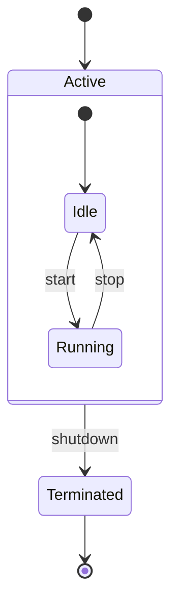

**Fork and Join:**
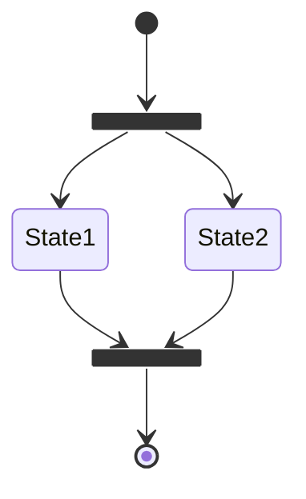

**Notes:**
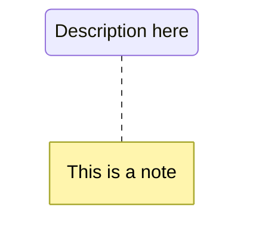

---

### 6. Entity Relationship Diagram

Models database entity relationships.

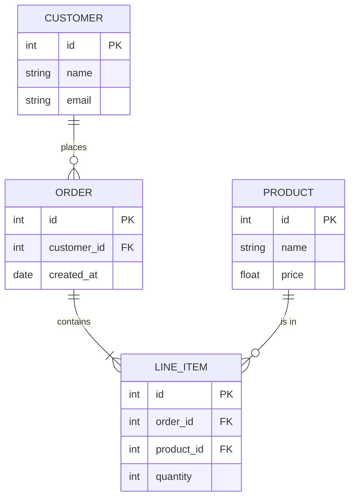

**Cardinality:**
- `||` - Exactly one
- `o|` - Zero or one
- `}|` - One or more
- `}o` - Zero or more

**Relationship syntax:** `ENTITY1 <cardinality1>--<cardinality2> ENTITY2 : label`

**Attribute types:**
- `PK` - Primary Key
- `FK` - Foreign Key
- `UK` - Unique Key

---

### 7. Gantt Chart

Models project schedules and timelines.

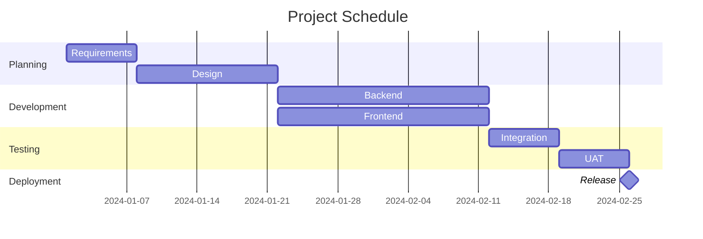

**Task tags:**
- `done` - Completed task
- `active` - Currently active
- `crit` - Critical path
- `milestone` - Milestone marker

**Date formats:**
- `YYYY-MM-DD` - Full date
- `after taskId` - After another task
- `7d` - Duration in days

---

### 8. Git Graph

Models Git branch history.

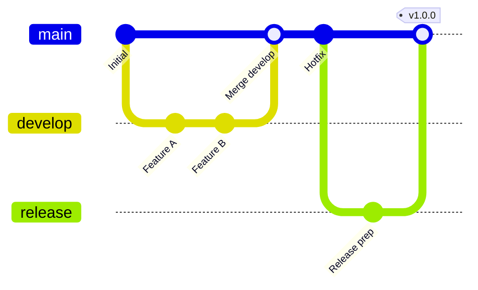

**Commands:**
- `commit` - Create a commit
- `branch name` - Create a branch
- `checkout name` - Switch to branch
- `merge name` - Merge branch
- `cherry-pick id` - Cherry-pick commit

**Commit options:**
- `id: "custom_id"` - Custom commit ID
- `tag: "v1.0"` - Add tag
- `type: NORMAL|REVERSE|HIGHLIGHT` - Commit type

---

### 9. Pie Chart

Simple pie chart visualization.

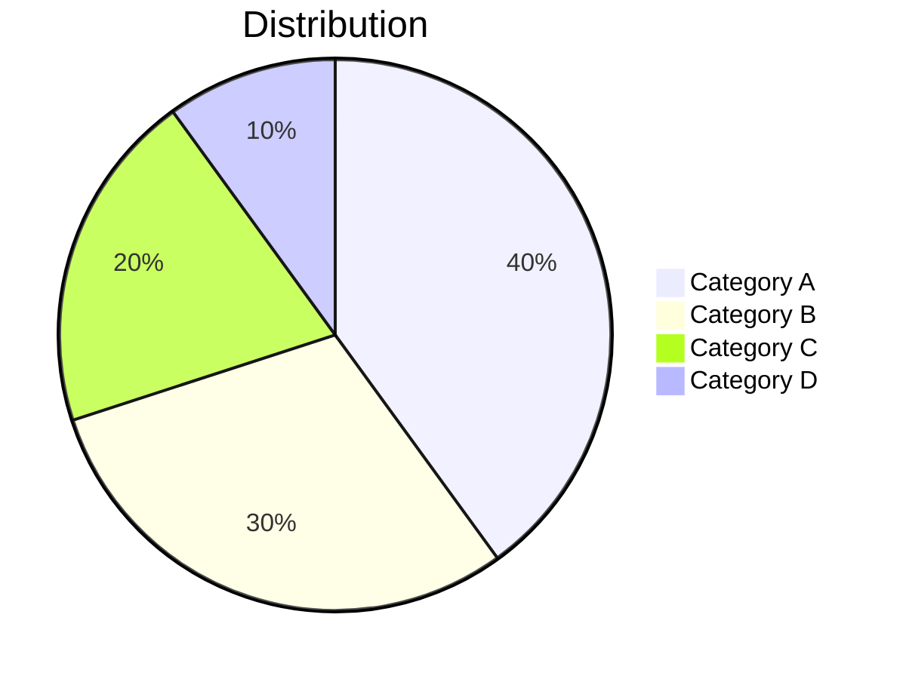

---

### 10. Mindmap

Hierarchical mindmap visualization.

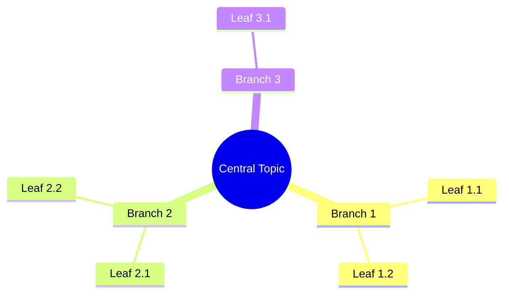

---

### 11. Timeline

Timeline visualization for events.

```mermaid
timeline
    title Project Timeline
    2024-Q1 : Planning phase
            : Requirements gathering
    2024-Q2 : Development phase
            : Testing begins
    2024-Q3 : Release
            : Customer feedback
```

---

### 12. Quadrant Chart

Four-quadrant analysis chart.

```mermaid
quadrantChart
    title Priority Matrix
    x-axis Low Effort --> High Effort
    y-axis Low Impact --> High Impact
    quadrant-1 Do First
    quadrant-2 Schedule
    quadrant-3 Delegate
    quadrant-4 Eliminate
    Task A: [0.8, 0.9]
    Task B: [0.3, 0.7]
    Task C: [0.7, 0.3]
    Task D: [0.2, 0.2]
```

---

### 13. Architecture Diagram (v11.1.0+)

Illustrates relationships between services and resources in Cloud or CI/CD deployments.

```mermaid
architecture-beta
    group api(cloud)[API]

    service db(database)[Database] in api
    service disk1(disk)[Storage] in api
    service server(server)[Server] in api

    db:L -- R:server
    disk1:T -- B:server
```

**Groups:**
```mermaid
architecture-beta
    group public(cloud)[Public Cloud]
    group private(cloud)[Private Cloud] in public

    service gateway(internet)[Gateway] in public
    service app(server)[App Server] in private
    service db(database)[Database] in private

    gateway:B -- T:app
    app:R -- L:db
```

**Services syntax:** `service <id>(<icon>)[<label>] in <group>`

**Default icons:**
- `cloud` - Cloud service
- `database` - Database
- `disk` - Storage/Disk
- `internet` - Internet/Gateway
- `server` - Server

**Custom icons (Iconify):**
Users can use 200,000+ icons from iconify.design by registering icon packs.
Format: `icon-pack:icon-name`

**Edges:**
- Connect services with `--`
- Specify side with `:L|R|T|B` (Left, Right, Top, Bottom)
- Syntax: `service1:side -- side:service2`

**Junctions:**
Special nodes for 4-way splits between edges.

```mermaid
architecture-beta
    service left(server)[Left]
    service right(server)[Right]
    service top(server)[Top]
    service bottom(server)[Bottom]
    junction junc

    left:R -- L:junc
    right:L -- R:junc
    top:B -- T:junc
    bottom:T -- B:junc
```

---

## Configuration with Frontmatter

You can configure diagrams using YAML frontmatter:

```mermaid
---
title: My Diagram
config:
    theme: dark
    themeVariables:
        primaryColor: "#ff0000"
---
flowchart LR
    A --> B
```

**Theme options:** default, forest, dark, neutral, base

---

## Best Practices

1. **Keep diagrams simple** - Break complex diagrams into multiple smaller ones
2. **Use meaningful labels** - Clear, concise text for nodes and relationships
3. **Consistent direction** - Choose LR or TB and stick with it
4. **Group related items** - Use subgraphs/boundaries for organization
5. **Add comments** - Use `%%` for documentation within diagrams
6. **Test in live editor** - Use https://mermaid.live for testing

---

## References

- Official Documentation: https://mermaid.js.org/
- Syntax Reference: https://mermaid.js.org/intro/syntax-reference.html
- Flowchart: https://mermaid.js.org/syntax/flowchart.html
- Sequence Diagram: https://mermaid.js.org/syntax/sequenceDiagram.html
- C4 Diagram: https://mermaid.js.org/syntax/c4.html
- Class Diagram: https://mermaid.js.org/syntax/classDiagram.html
- State Diagram: https://mermaid.js.org/syntax/stateDiagram.html
- ER Diagram: https://mermaid.js.org/syntax/entityRelationshipDiagram.html
- Gantt Chart: https://mermaid.js.org/syntax/gantt.html
- Git Graph: https://mermaid.js.org/syntax/gitgraph.html
- Architecture: https://mermaid.js.org/syntax/architecture.html
- Live Editor: https://mermaid.live
- GitHub: https://github.com/mermaid-js/mermaid
